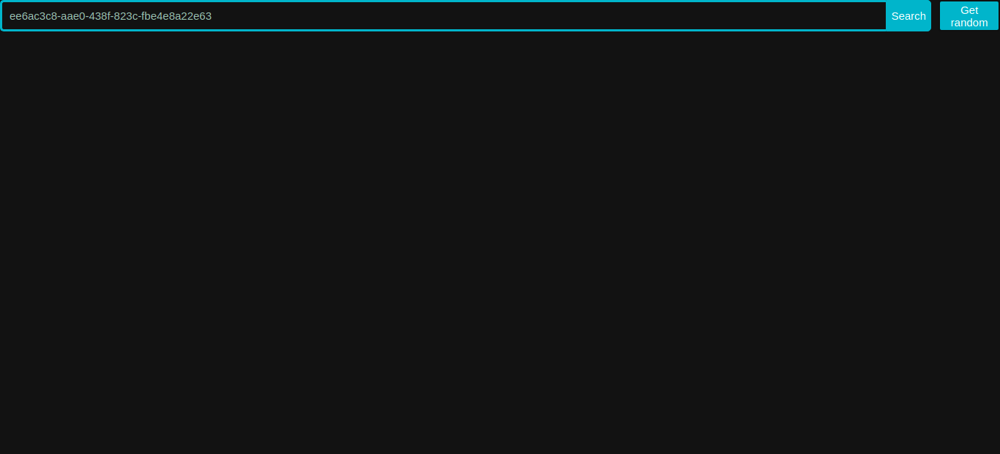
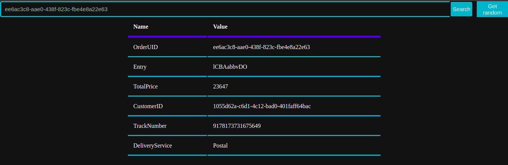
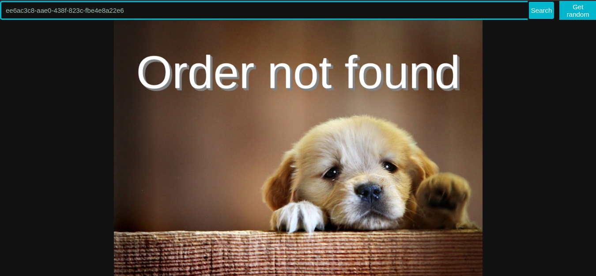
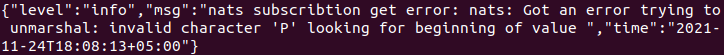
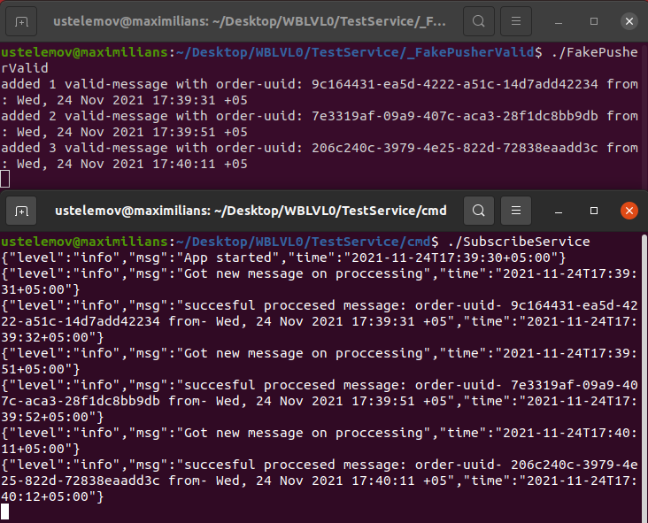
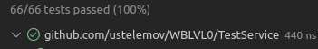
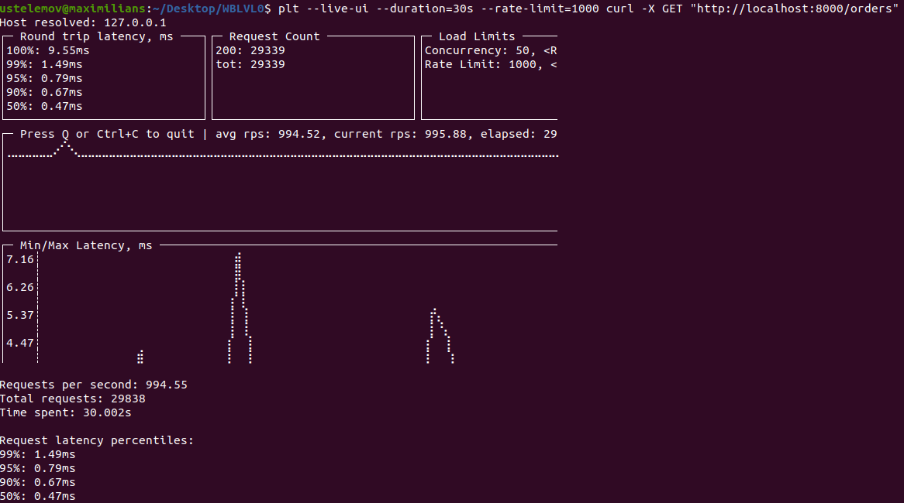
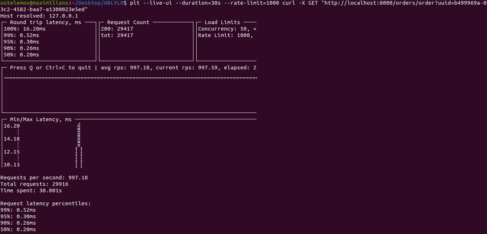

# Выполнение тестового задания:

## Cтруктура проекта:

- _FakePusherInvalid - Скрипт для тестирования подписки. Отправляет в обычное соединение простую структуру сообщения в байтах (невалидное сообщение для сервиса). Раз в 20 секунд.
- _FakePusherValid - Скрипт для тестирования подписки. Отправляет в Encoded соединение созданную с помощую gofakeit структуру Order в JSON. Раз в 20 секунд.
- cmd - main папка с точкой входа.
- cache - реализация кэша (Map).
- configs - конфиги с используемыми установочными данными.
- event - реализация брокера сообщений (NATS).
- handler - реализация HTTP REST API (Gin).
- repository - реализация работы с БД (Postgres).
- schema - используемые модели данных (Структы).
- server - реализация HTTP-сервера.
- service - реализация взаимодействия частей приложения.
- web - реализация WEB-интерфейса.

## В БД:
- [x] Подключиться к удаленной БД тестового сервера.
- [x] Создать свою БД.

Создана БД - Orders_test

- [x] Настроить своего пользователя.
- [x] Создать таблицы для хранения полученных данных.

Используется таблица - ordersjson с двумя столбцами: uuid (varchar) и order_data (jsonb).
Так как не требуется дополнительная работа с данными таблицы (БД используется, посути, как "бекап" кеша и синхронизация между копиями сервиса), выбран такой вариант, упрощая работу с БД: отсутствие лишних преобразований данных, отсутствие необходимости поддерживать несколько таблиц. Если потребуется какая-то дополнительная выборка данных - jsonb позволяет это.

## В сервисе:

- [x] Подключение и подписка на канал в nats-streaming
- [x] Полученные данные писать в Postgres

Для работы с БД Postgres использовалась "github.com/jmoiron/sqlx" с драйвером Postgres "github.com/lib/pq"

- [x] Также полученные данные сохранить in memory в сервисе (Кеш) 

Используется map[string]*Order, где string - uuid заявки, а *Order - ссылка на структуру заявки

- [X] В случае падения сервиса восстанавливать Кеш из Postgres
  
Все записи загружаются в кэш из БД по старту сервиса. На добавление строк в БД настроен триггер, в случае добавления новых строк (даже, к примеру, сторонним сервисом), в кэш будут добавлены соотвествующие записи.

- [X] Поднять http сервер и выдавать данные по id из кеша

Для реализации API используется https://github.com/gin-gonic/gin.
Используются end-point'ы:
GET: /orders - возвращает json c uuids всеx записей в кеше (в БД)
GET: /orders/order с параметром uuid - возвращает JSON с OrderOut структурой для записи с запрошенным UUID \ 404 ошибку если такой записи нет

- [ ] Выложить сервис в kubernetes
- [X] Сделать простейший интерфейс отображения полученных данных, для их запроса по id используя TypeScript

В поле требуется ввести UUID

Кнопка Get Random подставляет в поле случайный UUID из Кеша

По кнопке Search выполняет поиска заданного UUID, если он будет найдет, покажется OrderOut информация

А если нет - визаулизация 404 ошибки :)

- [X] Данные статичны, исходя из этого подумайте на счет модели хранения в Кеше и в pg

Исходя из этого пункта также был выбран формат хранения приходящего JSON целиком с возможностью его получения по UUID. 

- [X] В канал могут закинуть что угодно, подумайте как избежать проблем из-за этого

Создается Encoded Сonnection с типом JSON. Любые не Encoded-JSON сообщения будут выдавать ошибку в подпищике (ошибки логируем, но продолжаем работу). Также базово проверяем структуру после Unmarshal'a (наличие UUID..).

- [X] Чтобы проверить работает ли подписка онлайн, сделайте себе отдельный скрипт, для публикации данных в канал

Созданы два FakePublisher'а: валидный, открывающий Encoded соединение и отправляющий JSON
с сгенерированными с помощью https://github.com/brianvoe/gofakeit данными; невалидный, отправляющий по обычному соединению структуру-сообщение в байтах.

- [X] Подумайте как не терять данные в случае ошибок или проблем с сервисом

Хорошим вариантом является использование нескольких синхронизированных копий сервиса, в случае проблем с какой-то копией - данные не будут потеряны.

- [X] Покройте сервис автотестами. Будет плюси к вам в карму 😊

Для тестирования API-Handler'ов использутеся МОК сервиса с помощью: github.com/golang/mock/gomock. Для тестирования работы с БД используется МОК для sqlx: github.com/zhashkevych/go-sqlxmock. Для тестирования используется github.com/stretchr/testify/assert.

- [X] Устройте вашему сервису стресс тест, выясните на что он способен

Тестированание Nats (на локальной машине): было отправленно 1000 валидных сообщений с интервалом 5 миллисекунд, 
все сообщения были корректно обработаны одной копией сервиса за 3 минуты 30 секунд.

Тестировние API (на локальной машине): использовалась https://github.com/vearutop/plt с параметрами: 1000 пользователей в секунду в течении 30 секунд

> plt --live-ui --duration=30s --rate-limit=1000 curl -X GET "http://localhost:8000/orders"

> plt --live-ui --duration=30s --rate-limit=1000 curl -X GET "http://localhost:8000/orders/order?uuid=b499969a-03c2-4582-baa7-a1300023e5ed"

- [ ] Выложите в куб несколько копий сервиса (имитируем несколько дата центров). Подумайте на тему синхронизации этих копий

Подпищик каждого сервиса добавляется в очередь подпищиков, это гарантирует, что сообщение будет обработано только одним подпищиком.
В БД настроен триггер на обновление таблицы, всеми копия сервиса слушается канал триггера и в случае добавления новой записи, эту запись получают все подпищики, так мы добиваемся того, что в кеше каждого сервиса находяться актуальные данные.
